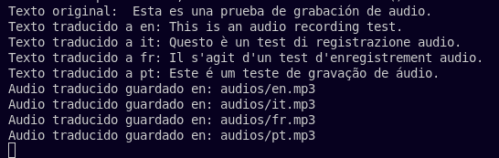
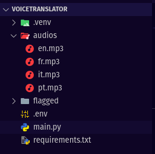

# VoiceTranslator

Hola! Este es un traductor de voz en Español a varios idiomas: Inglés, Francés, Italiano y Portugués, haciendo uso de IA.

La grabación de voz en Español está hecha con [gradio](https://www.gradio.app/), la transcripción a texto con [Whisper](https://github.com/openai/whisper), la traducción con [Translate](https://github.com/terryyin/translate-python) y la generación del audio traducido con [ElevenLabs](https://elevenlabs.io/docs/api-reference/getting-started).

Agradecimientos a [MoureDev](https://youtu.be/oxLvf2nDCvQ?si=8fC2fkEkYl_FwSfc) por compartir sus conocimientos!

## Cómo usar este proyecto

### Clonar el repositorio

    git clone git@github.com:sarismejiasanchez/VoiceTranslator.git

### Ingresar al directorio VoiceTranslator
    cd VoiceTranslator

### Crear directorio audios
En el directorio local, debes crear al directorio audios, allí se almacenarán los audios traducidos.

    mkdir audios

### Crear un entorno virtual

    python3 -m venv .env

### Activar entorno virtual 

    source venv/bin/activate

### Instalar la biblioteca `ffmpeg` 
Esta es una herramienta externa (binaria) requerida por Whisper y debe instalarse en el entorno virtual, pues no es una biblioteca Python.

    sudo apt-get install ffmpeg

### Instalar requirements.txt

    pip install -r requirements.txt
 
 ### Ejecutar main.py
 Esto abrirá tu proyecto en local en el navegador
 
 
### Output

### Verificar audios
