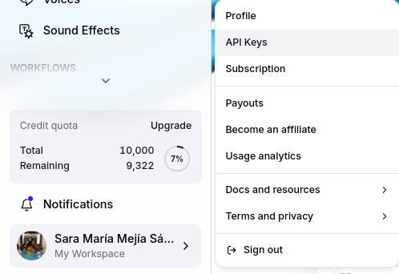
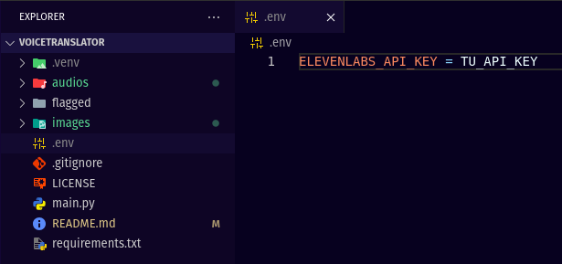
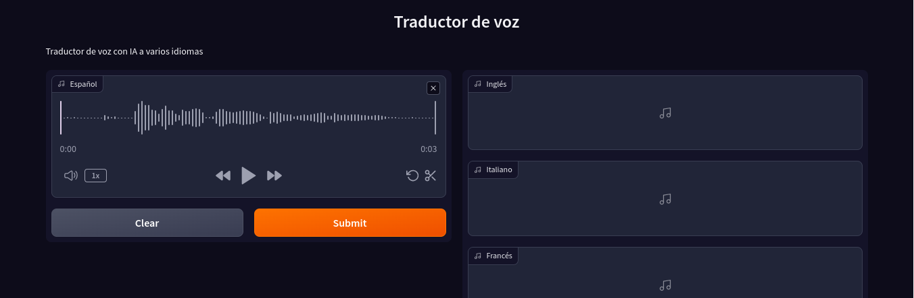
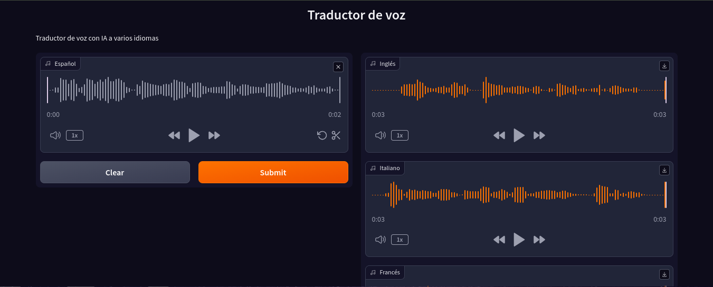

# VoiceTranslator

Hola! Este es un traductor de voz en Español a varios idiomas: Inglés, Francés, Italiano y Portugués, haciendo uso de IA.

La grabación de voz en Español está hecha con [gradio](https://www.gradio.app/), la transcripción a texto con [Whisper](https://github.com/openai/whisper), la traducción con [Translate](https://github.com/terryyin/translate-python) y la generación del audio traducido con [ElevenLabs](https://elevenlabs.io/docs/api-reference/getting-started).

Agradecimientos a [MoureDev](https://youtu.be/oxLvf2nDCvQ?si=8fC2fkEkYl_FwSfc) por compartir sus conocimientos!

## Cómo usar este proyecto

### Realizar un [FORK](https://github.com/sarismejiasanchez/VoiceTranslator/fork) del repositorio VoiceTranslator.

### Clonar el repositorio a tu máquina local

    git clone [TU-REPOSITORIO]

### Ingresar al directorio VoiceTranslator
    cd VoiceTranslator

### Crear un entorno virtual

    python3 -m venv .env

### Activar entorno virtual 

    source venv/bin/activate

### Instalar requirements.txt

    pip install -r requirements.txt

### Instalar la biblioteca `ffmpeg` 
Esta es una herramienta externa (binaria) requerida para trabajar con archivos de audio en Whisper y debe instalarse en el entorno virtual, pues no es una biblioteca Python.

Con esto evitamos la aparición del `[Errno 2] No such file or directory: 'ffmpeg'"`

    sudo apt-get install ffmpeg

### Generar API Key en [ElevenLabs](https://elevenlabs.io/app/speech-synthesis/text-to-speech)

### Crear archivo .env
En este archivo `enviroment`, almacenaremos la API Key de ElevenLabs.

    ELEVENLABS_API_KEY = TU_API_KEY

 ### Ejecutar main.py
 Esto puedes hacerlo desde tu editor de código o directamente desde la terminal.

    python3 main.py

 Esto ejecutará el proyecto en local y podrás accederlo desde el navegador.

 

 Aquí podrás grabar el audio en Español y dar clic en Submit.
 
 

  Con ello comenzará el proceso de Transcripción, Traducción a los diferentes lenguajes y finalmente la generación y descarga en local de los audios traducidos.
 
 
### Output

### Verificar audios
